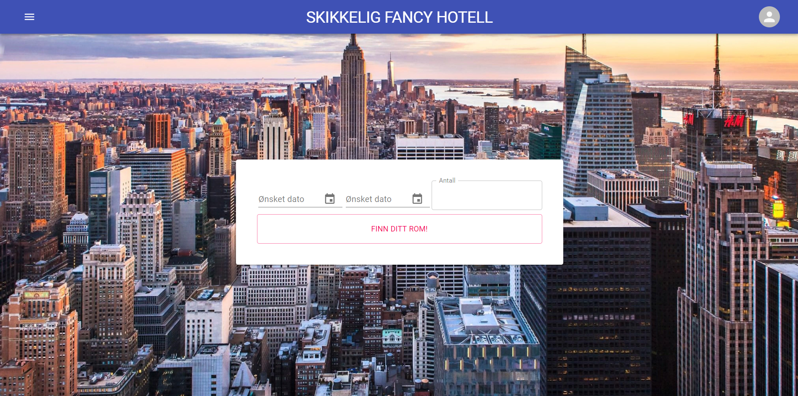
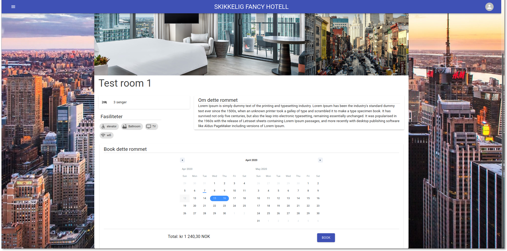

# Fancyhotell AS booking system

# Skikkelig Fancy Hotell AS

[Skikkelig Fancy Hotell AS](https://fancyhotell-staging.now.sh/) is a web application that allow users to book rooms at the hotel.
It is seperated into two parts, the `frontend` and `backend`.

See [frontend](#frontend) for details about the webapp.
See [backend](#backend) for details about the backend.

# Quick start

To get started, you need to set up the frontend, and backend.
See [frontend setup](#how-to-use) and [backend setup](#how-to-use-1) for setup.

# Deployment

The two applications are currently hosted on Heroku and Zeit now.

The deployment is configured in the gitlab ci pipleline, see [.gitlab-ci.yml](./.gitlab-ci.yml) for
details. The pipeline is separated into a couple stages: `setup`, `tests`, `build`, `review` and
`deploy`. These stages define what _jobs_ can be run concurrently.

The pipeline is setup to run jobs on a couple different conditions:

- The frontend jobs in the `setup` and `tests` stages run on merge requests, whenever any files in
  the `frontend` directory have been edited.
- Likewise, backend jobs under `setup` and `tests` run whenever any files have been edited in the
  `backend` directory in a merge request.
- The `review` stage only contains a frontend job to deploy a review app to _Zeit now_. This is
  manually triggered on a merge request, when the tests have passes.
- The `deploy` jobs will when a new commit is pushed to the `master` or `prod` branch.
  - On a push to `master`, the frontend is deployed to _zeit now_ under the staging environment.
    Meaning a new version is deployed, and the url `fancyhotell-staging.now.sh` is set to point to
    the new version. The backend is also deployed to the Heroku app `fancyhotell-staging`.
  - On a push to `prod`, the frontend is deploy to _zeit now_ with the `--prod` flag, indicating
    that it is to be deployed to production. The backend is also deployed to the heroku app
    `fancyhotell`.

> For more details, see the GitLab pipeline documentation

## Environment variables

The pipeline utilizes a couple environment variables when deploying. These are set in the GitLab
CI/CD settings page.

- `ZEIT_NOW_TOKEN`: A personal token giving access to the zeit now project.
- `API_URL`: The API url for the production environment.
- `STAGING_API_URL`: The API url for the staging environment.
- `HEROKU_API_KEY`: A personal API key for an account with access to both Heroku applications.

# License

The project incorporates the GNU license, see full disclosure under [LICENSE](./LICENSE).

> You may copy, distribute and modify the software as long as you track changes/dates in source files. Any modifications to or software including (via compiler) GPL-licensed code must also be made available under the GPL along with build & install instructions.

The GNU-license fits the project's need by making further development loose, but still enforcing that software built based on the project's source code is open-source.

# Frontend

> Skikkelig fancy hotell webapp

This is the front-end app for `Skikkelig Fancy Hotell`. It serves to be a user friendly way of interacting with the back-end to book hotels, edit user information etc.

|                                        |                                        |
| :------------------------------------: | :------------------------------------: |
|  |  |

**Built with**

- [Next.js](https://nextjs.org/)
- [MATERIAL-UI](https://material-ui.com/)

## Table of Contents

- [How to use](#how-to-use)
  - [Setup](#setup)
  - [Development](#development)
  - [Linting and checking formatting](#linting-and-checking-formatting)
  - [Apply formatting](#apply-formatting)
  - [Run tests](#run-tests)
- [Structure](#structure)
  - [Pages](#pages)
    - [Special pages](#special-pages)
  - [Components](#components)
    - [Layout](#layout)
    - [UserProvider](#userprovider)
  - [Utilities](#utilities)
    - [API](#api)
    - [Cookies](#cookies)
  - [Tests](#tests)
  - [Static files](#static-files)
- [Environment Variables](#environment-variables)
- [Extended libraries](#extended-libraries)

## How to use

#### Prerequisites

- [node.js](https://nodejs.org/en/download/)
- [yarn](https://classic.yarnpkg.com/en/docs/install#debian-stable)

### Setup

```
$ git clone ...
$ cd frontend
$ yarn
```

### Development

```
$ yarn dev
# Open http://localhost:3000
```

### Linting and checking formatting

Linted with [ESLint](https://eslint.org/)

```
$ yarn lint
```

### Apply formatting

Formatted with [Prettier](https://prettier.io/)

```
$ yarn prettier
```

### Run tests

Tests written with [Jest](https://jestjs.io/)

<!-- and makes sure the most vital parts of the application are intact. -->

```
$ yarn test
```

## Structure

The app is very modular and divided into different sections to keep it clear. It utilizes [functional components](https://reactjs.org/docs/components-and-props.html) and [hooks](https://reactjs.org/docs/hooks-overview.html#state-hook).

### Pages

Every page other than the root `index.js` is in its own folder within `pages` with possible subfolders.

The pages are not supposed to keep intricate logic. Their main task is to simply render a collection of components.

The [Layout](#Layout)-component should be the root-component of every page to keep the UI consistent.

#### Special pages

[\_app.js](https://nextjs.org/docs/advanced-features/custom-app) and [\_document.js](https://nextjs.org/docs/advanced-features/custom-document) are `Next.js`-specific files.

- `_app.js` overrides the standard `App`-component and controls the page initialization.
- `_document.js` is used to augment, along with other things, the application's \<html> and \<body> tags.

### Components

For every page there's an equal folder in the `components`-folder in which every component used in the given page should be placed. If a given component is used by several pages it should be placed in the `shared`-folder.

#### Layout

To keep the Layout consistent, the `Layout`-component should be as static as possible, and only changed through props. It passes [Context](https://reactjs.org/docs/context.html) to its children through the [UserProvider](#UserProvider)-component.

#### UserProvider

To keep global state the project utilize the [Context](https://reactjs.org/docs/context.html)-API. It provides a way to pass data through the component tree without having to pass props down manually at every level. The UserProvider-state is set with `useState` and can be changed to fit the data needed.

### Utilities

Utility-functions should be placed in the `utils`-folder.

#### API

Every function that communicates through an API should be defined in `api.js`. To make the API-calls easier the project uses [SWR](swr.now.sh), a React Hooks library for remote data fetching. The `SWRConfig` is wrapped outside the `_app.js`-page.

#### Cookies

To provide a smooth user-experience where users aren't logged out on page-reload, the project utilize cookies through [js-cookie](https://github.com/js-cookie/js-cookie). It takes a user's `accessToken` as input and resets every day, if the cookie isn't manually reset.

### Tests

Test are defined in `test`. They provide unit-testing by testing that every page renders. More tests should be written as the project grows. Written with [jest](https://jestjs.io/).

### Static files

Static files that need to be served should be placed within the `public`-folder. The files can then be accessed throughout the project by reffering `/filename.extension`

## Environment Variables

The project facilitates the use of environment variables through [dotenv](https://www.npmjs.com/package/dotenv). The environment variables should be stored in the root of `config`.

## Extended libraries

The project uses a handful of different libraries to simplify tasks such as date-formatting, load-indication etc. For the full overview, refer to `package.json` and check out the imported packages underneath `dependencies` and `dev-dependencies`.

# Backend

> Skikkelig fancy hotell API

## Table of contents

- [How to use](#how-to-use)
  - [Setting up the project](#Setup)
  - [Development](#development)
  - [Linting and formatting](#linting-and-formatting)
  - [Running tests](#tests)
- [Project structure](#structure)
  - [Apps](#apps)
- [Settings](#settings)
- [Documentation](#documentaion)

## How to use

### Setup

The backend requires python 3.7 and pip.

- [python](https://www.python.org/downloads/)
- [pip](https://pypi.org/project/pip/)

```sh
$ git clone git@gitlab.stud.idi.ntnu.no:tdt4140-2020/37.git
$ cd backend
```

### Development

**Installing dependencies**

```sh
# Create a new python virtual environment
$ python3 -m venv venv
$ source venv/bin/activate
# Install python dependencies
$ pip install -r requirements/dev.txt
```

**Migrate the database**

```sh
$ ./manage.py migrate
```

**Loading test data**
There are a set of fixtures used to provide some data for testing. Load this data into the database
by running the command:

This creates an admin user that can be used. The credentials are:
email: `admin@fancyhotell.now.sh`
password: `admin`

```sh
$ ./manage.py loaddata room_fixtures
```

**Start the development server**

```sh
$ ./manage.py runserver
# Server runs on localhost:8000
```

### Linting and formatting

**Black**

```sh
$ black --check fancyhotell

# To let black format your code, omit the --check
$ black fancyhotell
```

**flake8**

We use flake8 as our linter for python. Make sure the code passes the checks.

```sh
$ flake8
```

### tests

We use `pytest` to test our project. It is installed with the installation steps above.

```sh
# To run the tests, simply run
$ pytest
```

Pytest configuration is in the file `pytest.ini`. It is set up to run tests defined in all files
following the following naming schema:

- The file starts with `test_`
- The file ends with `_tests.py`
- The file is called `tests.py` or `test.py`

Any tests created in these files will be run automatically when you run `pytest`.

The file `conftest.py` defines the testata we use, along with a set of _fixtures_. See the pytest
documentaion for how these special functions work, and how to use them.

## Structure

### Apps

The backend application consists of two _django apps_, `users`, and `rooms`. Each app is in its own
folder in the root `backend` folder.

The `users` app defines models, views and serializers for user data, while the `rooms` app defines
the same for rooms and bookings. In addition to the serializers, views and models, we also define
permissions for each of the apps. These are used to control what users should have access to do
f.ex. that only administrators can edit rooms.

## Settings

The application settings is defined in `settings.py`. This is, among other things, applications
installed, allowed CORS urls, middlewares and secret key.

A setting of particular interest, is the DATABASE_URL. This variable provides the url, with
username and password, to the database that the application should use. This defaults to an
sqlite database in the
same directory as `manage.py`. To change this setting, you can provide an environment variable with
the same name, `DATABASE_URL`. This can be whichever valid database url, so long as it is supported
by django. In addition to the default supported databases, we support postgreSQL, which we use in
deployment.

## Documentation

We have two different documentaion engines for the API, both using the openAPI specification. These
are two wep pages providing an overview of the API, with details about what endpoints are available,
what HTTP methods they allow, and what data an endpoint requires or provides.

> NOTE: The payload shown by these pages will not always be 100% correct.

These pages are auto-generated, so you do not need to update these yourself. You can browse the
documdocumentaion at https://fancyhotell.herokuapp.com/redoc and
https://fancyhotell.herokuapp.com/swagger. Or navigate to the pages from the backend landing page.
