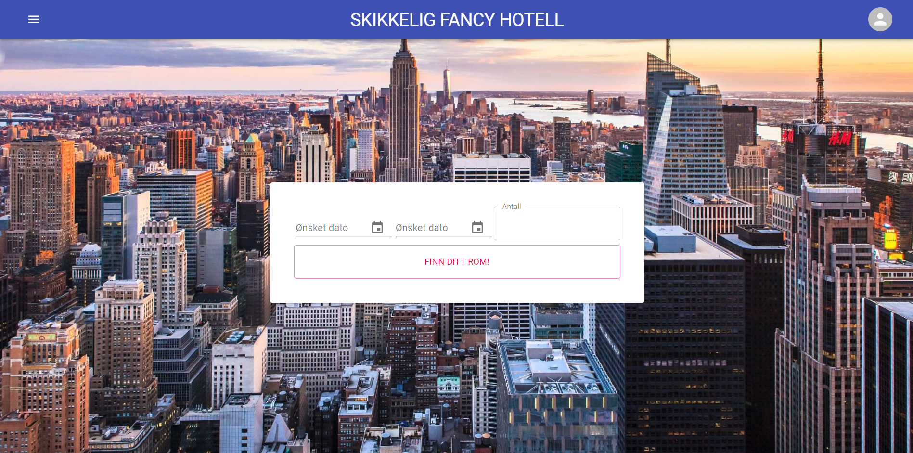

# Skikkelig Fancy Hotell

This is the front-end app for `Skikkelig Fancy Hotell`. It serves to be a user friendly way of interacting with the back-end to book hotels, edit user information etc.

**Built with**

- [Next.js](https://nextjs.org/)
- [MATERIAL-UI](https://material-ui.com/)



# Table of Content

- [How to use](#how-to-use)
  - [Setup](#setup)
  - [Development](#development)
  - [Linting and checking formatting](#linting-and-checking-formatting)
  - [Apply formatting](#apply-formatting)
  - [Run tests](#run-tests)
- [Structure](#structure)
  - [Pages](#pages)
    - [Special pages](#special-pages)
  - [Components](#components)
    - [Layout](#layout)
    - [UserProvider](#userprovider)
  - [Utilities](#utilities)
    - [API](#api)
    - [Cookies](#cookies)
  - [Tests](#tests)
  - [Static files](#static-files)
- [Environment Variables](#environment-variables)
- [Extended libraries](#extended-libraries)

# How to use

### Prerequisites

- [yarn](https://yarnpkg.com/)

## Setup

```
$ git clone ...
$ cd frontend
$ yarn
```

## Development

```
$ yarn dev
# Open http://localhost:3000
```

## Linting and checking formatting

Linted with [ESLint](https://eslint.org/)

```
$ yarn lint
```

## Apply formatting

Formatted with [Prettier](https://prettier.io/)

```
$ yarn prettier
```

## Run tests

Tests written with [Jest](https://jestjs.io/)

<!-- and makes sure the most vital parts of the application are intact. -->

```
$ yarn test
```

# Structure

The app is very modular and divided into different sections to keep it clear. It utilizes [functional components](https://reactjs.org/docs/components-and-props.html) and [hooks](https://reactjs.org/docs/hooks-overview.html#state-hook).

## Pages

Every page other than the root `index.js` is in its own folder within `pages` with possible subfolders.

The pages are not supposed to keep intricate logic. Their main task is to simply render a collection of components.

The [Layout](#Layout)-component should be the root-component of every page to keep the UI consistent.

### Special pages

[\_app.js](https://nextjs.org/docs/advanced-features/custom-app) and [\_document.js](https://nextjs.org/docs/advanced-features/custom-document) are `Next.js`-specific files.

- `_app.js` overrides the standard `App`-component and controls the page initialization.
- `_document.js` is used to augment, along with other things, the application's \<html> and \<body> tags.

## Components

For every page there's an equal folder in the `components`-folder in which every component used in the given page should be placed. If a given component is used by several pages it should be placed in the `shared`-folder.

### Layout

To keep the Layout consistent, the `Layout`-component should be as static as possible, and only changed through props. It passes [Context](https://reactjs.org/docs/context.html) to its children through the [UserProvider](#UserProvider)-component.

### UserProvider

To keep global state the project utilize the [Context](https://reactjs.org/docs/context.html)-API. It provides a way to pass data through the component tree without having to pass props down manually at every level. The UserProvider-state is set with `useState` and can be changed to fit the data needed.

## Utilities

Utility-functions should be placed in the `utils`-folder.

### API

Every function that communicates through an API should be defined in `api.js`. To make the API-calls easier the project uses [SWR](swr.now.sh), a React Hooks library for remote data fetching. The `SWRConfig` is wrapped outside the `_app.js`-page.

### Cookies

To provide a smooth user-experience where users aren't logged out on page-reload, the project utilize cookies through [js-cookie](https://github.com/js-cookie/js-cookie). It takes a user's `accessToken` as input and resets every day, if the cookie isn't manually reset.

## Tests

Test are defined in `test`. They provide unit-testing by testing that every page renders. More tests should be written as the project grows. Written with [jest](https://jestjs.io/).

## Static files

Static files that need to be served should be placed within the `public`-folder. The files can then be accessed throughout the project by reffering `/filename.extension`

# Environment Variables

The project facilitates the use of environment variables through [dotenv](https://www.npmjs.com/package/dotenv). The environment variables should be stored in the root of `config`.

# Extended libraries

The project uses a handful of different libraries to simplify tasks such as date-formatting, load-indication etc. For the full overview, refer to `package.json` and check out the imported packages underneath `dependencies` and `dev-dependencies`.
